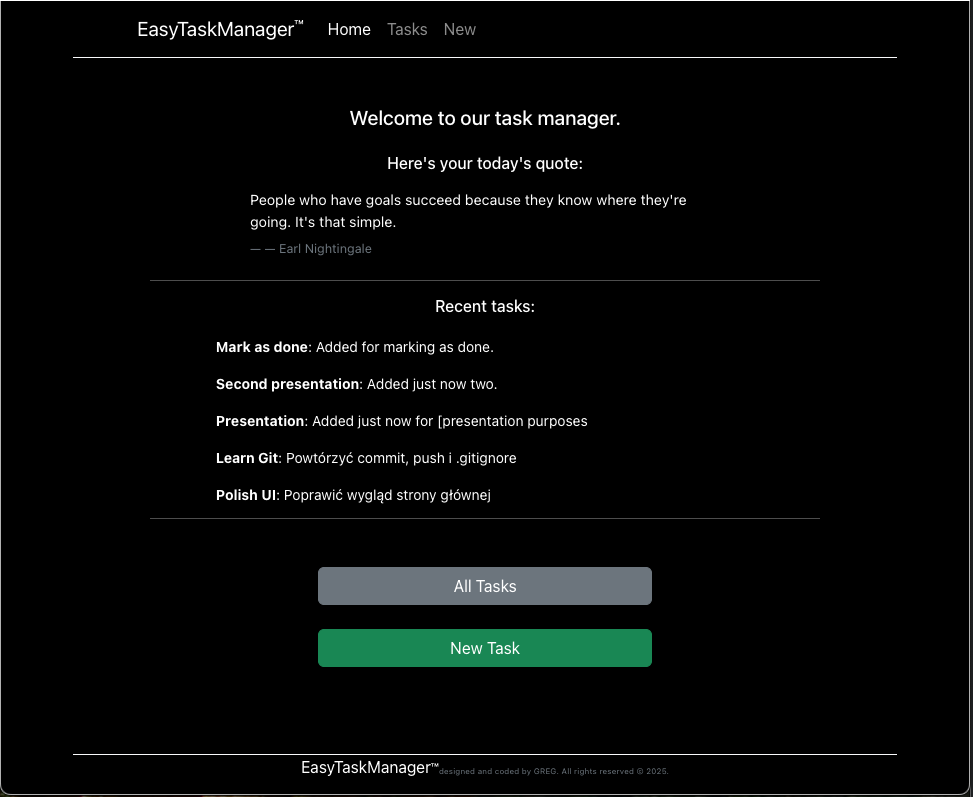
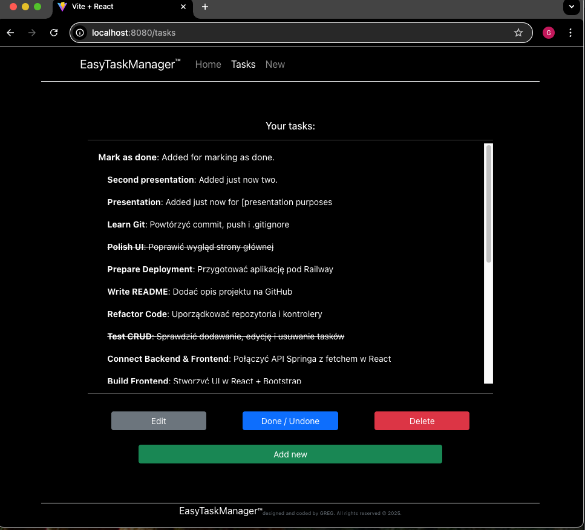
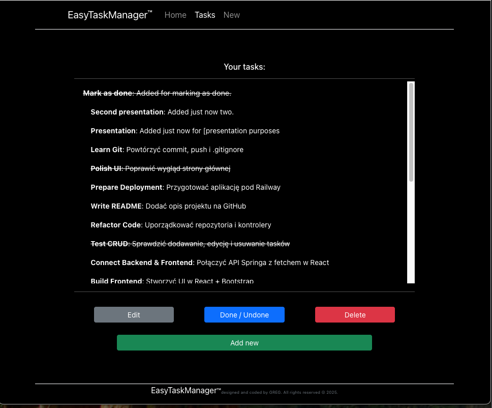
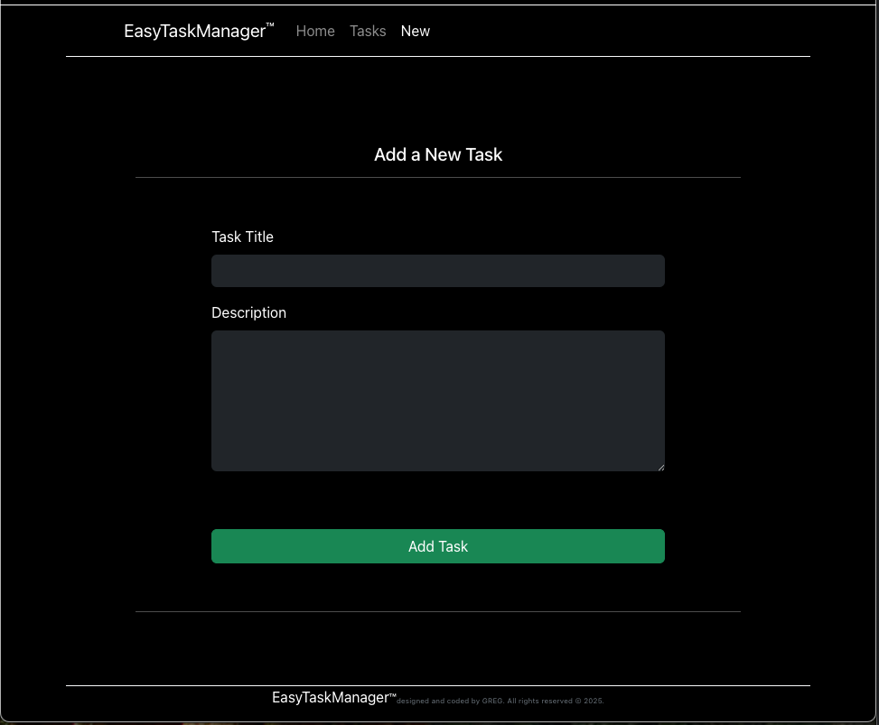

# EasyTaskManager

EasyTaskManager is a full-stack task management web application designed for simplicity and usability. It allows users to create, view, edit, complete, and delete tasks through a user-friendly interface. The backend is powered by Java and Spring Boot, while the frontend is built with React and Bootstrap, using Vite for fast development.

## ✨ Features

- 📝 Add new tasks with title and description
- ✅ Mark tasks as done or undone
- ✏️ Edit existing tasks
- 🗑️ Delete tasks
- 🌟 View the 5 latest tasks on the homepage
- 📜 Daily motivational quote fetched from an external API
- 🎨 Responsive, minimal UI with dark theme (Bootstrap)
- 🔗 Full REST API integration with JSON communication

## 🔧 Technologies Used

### Backend:
- Java 17
- Spring Boot (REST API)
- Spring Web
- Spring DevTools
- PostgreSQL (via Docker) as local database
- Spring Data JPA + Hibernate for communication with DB


### Frontend:
- React (functional components + Hooks)
- Vite
- Bootstrap 5 (React-Bootstrap)
- React Router
- Fetch API for backend integration


## 🚀 Getting Started

### 1. Clone the repository

```bash
git clone https://github.com/your-username/EasyTaskManager.git
cd EasyTaskManager
```

### 2. Backend Setup (Spring Boot)

```bash
cd backend
./mvnw spring-boot:run
```

Frontend is built in a backend so full application runs at: `http://localhost:8080`
*(Note: the frontend is bundled into the backend during build, but can also be run separately for development with `npm run dev`.)*

## 📸 Screenshots

### Homepage

Homepage showing daily motivational quote and latest tasks.

### Tasks List

Tasks page with full tasks list and CRUD buttons below.

List of all tasks with the first one selected and marked as done.
### Add Task

Add new task page.

## 📌 Changelog

- ✅ Integrated frontend (React build) with backend (Spring Boot)
- ✅ Updated fetch paths to support unified deployment (`/tasks`, `/quotes`)
- ✅ Applied global CSS fixes to ensure mobile responsiveness after build 
- ✅ Prepared Railway deployment (currently inactive due to subscription)
- ✅ Added local Postgres Database
- ✅ Integrated application with database
- ✅ Updated README.md with pictures


## 🧑‍💻 Author

**Grzegorz Dzyg** – Computer Science student at WSB-NLU, 2025  
Built as part of academic portfolio & real-world experience.

## 📜 License

This project is licensed under the MIT License.
